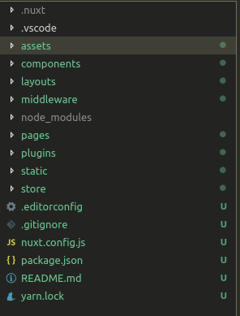

# Nuxt-TS: Nuxt application powered by TypeScript

[Nuxt 2.4.0 release (Jan-2019)](https://dev.to/nuxt/nuxtjs-v240-is-out-typescript-smart-prefetching-and-more-18d)
has pushed one step forward TypeScript integration into Nuxt. **Kudos to Nuxt team**.

Half tutorial, half exploration, I want to check out how far I can get
with Nuxt+TypeScript in a full application from scratch.

- [01. Initialise Project](#initialise-project)
- [02. Switch to TypeScript](#switch-to-typescript)
- [03. Code control: formatter and linter](#code-control-formatter-and-linter)
  - [03.1 Prettier](#prettier)
  - [03.2 ESLint](#eslint)

## Initialise project

Create a NuxtJS project as usual ([Nuxt doc](https://nuxtjs.org/guide/installation)):

```sh
yarn create nuxt-app {your project name}
```

For the sake of the tutorial, my _nuxt-ts_ project is bare metal: no
plugins, no CSS framework, default server framework, no test
framework. I selected _Yarn_ as my package manager.


The Nuxt project structure is explained in [Nuxt doc](https://nuxtjs.org/guide/directory-structure):



Run the scaffolded project:

```sh
cd {your project folder}
yarn dev
```

Nuxt should not encounter any error:


And the application should be available on <http://localhost:3000>:


## Switch to TypeScript

Before adding anything, let switch to TypeScript first. I was
guided by the two following links:

- [Nuxt-ts helloworld](https://codesandbox.io/s/github/nuxt/nuxt.js/tree/dev/examples/typescript)
- [Hackernews on nuxt-ts](https://github.com/nuxt-community/hackernews-nuxt-ts)

### Adding Nuxt-ts

```sh
yarn add nuxt-ts
yarn add --dev nuxt-property-decorator
yarn remove nuxt
```

- `nuxt-ts` is TypeScript counterpart of `nuxt`
- [`nuxt-property-decorator`](https://github.com/nuxt-community/nuxt-property-decorator/) is
  Nuxt counter part of [`vue-property-decorator`](https://github.com/kaorun343/vue-property-decorator)

Optionally, you can add TypeScript as a development dependency:

```sh
yarn add --dev typescript
```

For VS Code users, you can force the usage of TypeScript from _node_modules/_
instead of using default VS Code TypeScript thanks to _.vscode/settings.json_:

```json
{
  // Windows version
  "typescript.tsdk": "node_modules\\typescript\\lib",
  // Linux
  "typescript.tsdk": "node_modules/typescript/lib"
}
```

### Update configuration

Few configurations have to be added or changed:

Update _package.json_ by using `nuxt-ts` instead of `nuxt`:

```json
{
  "scripts": {
    "dev": "nuxt-ts",
    "build": "nuxt-ts build",
    "start": "nuxt-ts start",
    "generate": "nuxt-ts generate"
  }
}
```

Add a tsconfig.json:

```json
{
  "extends": "@nuxt/typescript",
  "compilerOptions": {
    "baseUrl": ".",
    "types": ["@types/node", "@nuxt/vue-app"],
    "experimentalDecorators": true,
    "resolveJsonModule": true,
    "esModuleInterop": true,
    "paths": {
      "@/*": ["*"],
      "~/*": ["*"]
    }
  }
}
```

- `experimentalDecorators` is required when using Vue decorators
- `resolveJsonModule` and `esModuleInterop` are required when
  [importing JSON in TypeScript](https://hackernoon.com/import-json-into-typescript-8d465beded79)
- `paths` are Nuxt convention and [it rocks with VS Code](https://medium.com/@caludio/how-to-use-module-path-aliases-in-visual-studio-typescript-and-javascript-e7851df8eeaa)

Renaming _nuxt.config.js_ into _nuxt.config.ts_. I simply change the first line:

```diff
- var pkg = require('./package')
+ import pkg from "./package.json";
```

and commented out the `build: { ... }` content to avoid having a _"declared but never used"_
and _"implicitly has an 'any' type"_ error

## Update existing code

The scaffolded application is not much, only _pages/index.vue_ has to
be updated:

```vue
<script lang="ts">
import { Component, Vue } from 'nuxt-property-decorator';

import Logo from '@/components/Logo.vue';

@Component({
  components: {
    Logo
  }
})
export default class Index extends Vue {}
</script>
```

> Don't forget `lang="ts"`!

## Code control: formatter and linter

### Prettier

[Prettier](https://prettier.io) is an opinionated formatter.

```sh
yarn add --dev prettier
```

VS Code users, don't forget the [VS Code Prettier](https://marketplace.visualstudio.com/items?itemName=esbenp.prettier-vscode)
extension.

Add a _.prettierrc_ file to configure prettier. Options can be found on
[Prettier documentation](https://prettier.io/docs/en/options.html):

```json
{
  "semi": true,
  "singleQuote": true
}
```

### ESLint

At first, I planned to use [TSLint](https://palantir.github.io/tslint/) but
[_TypeScript ecosystem is moving from TSLint to ESLint_](https://cmty.app/nuxt/nuxt.js/issues/c8742)
so let's move as well.

Let's add [ESLint](https://eslint.org) some plugins:
- [`@typescript-eslint/eslint-plugin`](https://github.com/typescript-eslint/typescript-eslint/tree/master/packages/eslint-plugin)
- [`eslint-config-prettier`](https://github.com/prettier/eslint-config-prettier) due
  to our _Prettier_ usage
- [`eslint-plugin-vue`](https://vuejs.github.io/eslint-plugin-vue/) per [Nuxt documentation](https://nuxtjs.org/guide/development-tools/#eslint-and-prettier)

```sh
yarn add --dev eslint @typescript-eslint/eslint-plugin eslint-config-prettier eslint-plugin-vue
```

Configure ESLint with the _.eslintrc.js_ file:

```js
module.exports = {
  root: true,

  env: {
    browser: true,
    node: true
  },

  parser: 'vue-eslint-parser',
  parserOptions: {
    parser: '@typescript-eslint/parser',
    ecmaVersion: 2017,
    sourceType: 'module',
    project: './tsconfig.json'
  },

  extends: [
    'eslint:recommended',
    'plugin:@typescript-eslint/recommended',
    'plugin:vue/recommended',
    'prettier',
    'prettier/vue',
    'prettier/@typescript-eslint'
  ],

  plugins: ['vue', '@typescript-eslint']
};
```

Few explanations:
- `vue-eslint-parser` is required by `eslint-plugin-vue` (check [doc](https://vuejs.github.io/eslint-plugin-vue/user-guide/#faq))
  and as `@typescript-eslint/parser` is required, it is moved to `parserOptions`
- Order in `extends` matters. Prettier configurations are at the end to ensure they
  override other rules
- `env` is set to `browser` and `node` for SSR reasons (check [Nuxt doc](https://nuxtjs.org/guide/development-tools/#eslint-and-prettier))