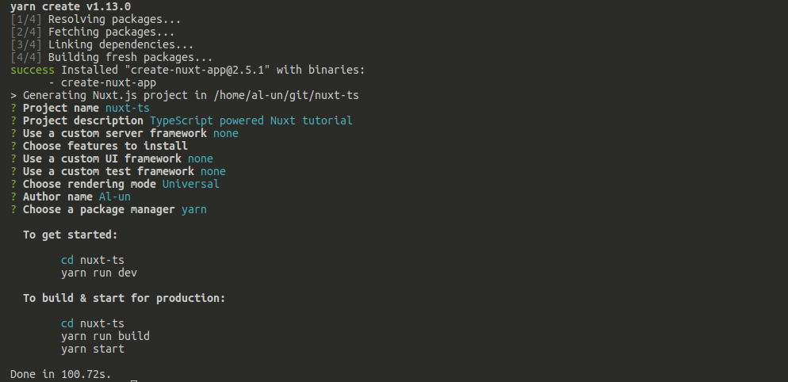
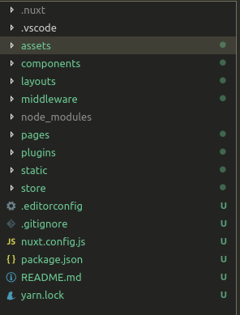
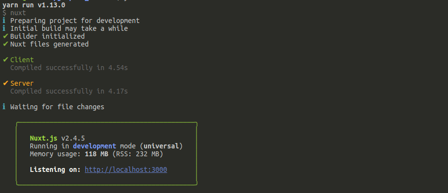
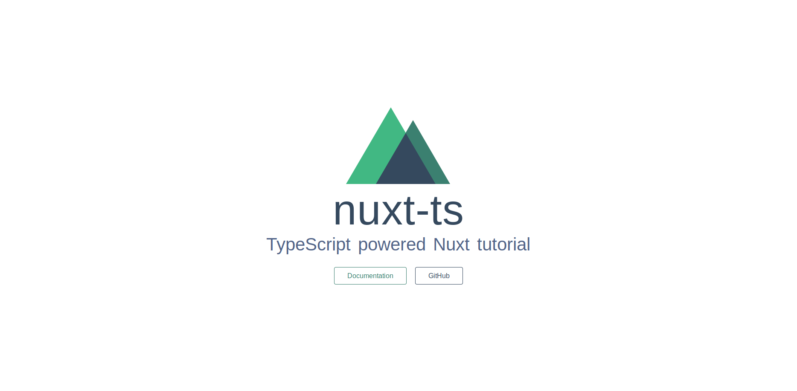

## Initialise project

Create a NuxtJS project as usual ([Nuxt doc](https://nuxtjs.org/guide/installation)):

```sh
yarn create nuxt-app {your project name}
```

For the sake of the tutorial, my _nuxt-ts_ project is bare metal: no
plugins, no CSS framework, default server framework, no test
framework. I selected _Yarn_ as my package manager.



The Nuxt project structure is explained in [Nuxt doc](https://nuxtjs.org/guide/directory-structure):



Run the scaffold project:

```sh
cd {your project folder}
yarn dev
```

Nuxt should not encounter any error:



And the application is available on <http://localhost:3000>:


