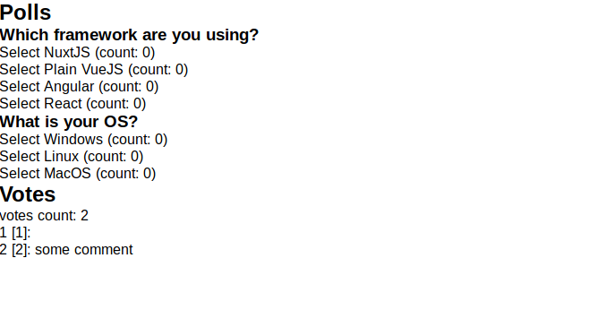
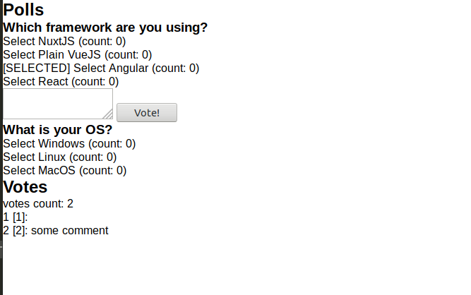
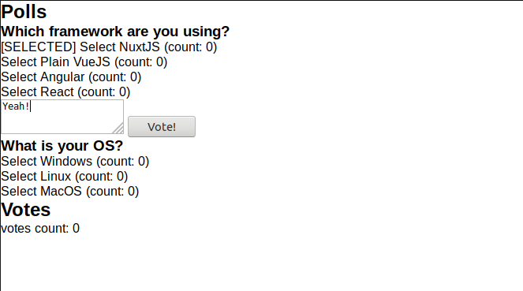
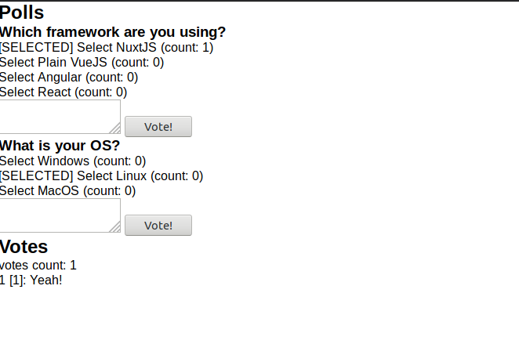

## Polls: Components and Vuex

Let's explorer further `nuxt-property-decorator`. Instead of the eternal _Counter_ example,
let's try something, not that different: Polls. Polls have questions with multiple choices.
The interface lets you vote for choice and you can optionally add some comment to your vote.

### Polls Models

Before getting into VueJS/Nuxt affairs, Polls models must be defined. This is
pure TypeScript writing so I won't dive into details.

I define my models in _lib/polls/models.ts_. As models are not depending on
the store nor components, I decided to create a _lib/_ folder to serve this
purpose.

```ts
/**
 * A vote for a given choice
 */
export class Vote {
  public constructor(
    public id: number,
    public choiceId: number,
    public comment?: string
  ) {}
}

/**
 * A choice to vote for within a Poll
 */
export class Choice {
  public count: number;

  public constructor(
    public id: number,
    public pollId: number,
    public text: string
  ) {
    this.count = 0;
  }
}

/**
 * A topic with which user is offered multiple choices to vote for
 */
export class Poll {
  public choices: Choice[];

  public constructor(
    public id: number,
    public topic: string,
    choices?: Choice[]
  ) {
    this.choices = choices !== undefined ? choices : [];
  }
}

/**
 * An intention of voting a given choice with an optional comment
 */
export interface ChoiceVote {
  choiceId: number;
  comment?: string;
}
```

To provide polls, I created a _lib/polls/api.ts_ file with a dummy variables:

```ts
import { Poll } from './models';

/**
 * Dummy polls
 */
export const DUMMY_POLLS: Poll[] = [
  {
    id: 1,
    topic: 'Which framework are you using?',
    choices: [
      { id: 1, count: 0, pollId: 1, text: 'NuxtJS' },
      { id: 2, count: 0, pollId: 1, text: 'Plain VueJS' },
      { id: 3, count: 0, pollId: 1, text: 'Angular' },
      { id: 4, count: 0, pollId: 1, text: 'React' }
    ]
  },
  {
    id: 2,
    topic: 'What is your OS?',
    choices: [
      { id: 5, count: 0, pollId: 2, text: 'Windows' },
      { id: 6, count: 0, pollId: 2, text: 'Linux' },
      { id: 7, count: 0, pollId: 2, text: 'MacOS' }
    ]
  }
];
```

### Polls Page

Let's add an empty page _pages/polls.vue_. For lazy people like me, feel free to add a
link : TypeScript components in _pages/index.vue_:

```html
<template>
  <section class="container">
    <!-- put that wherever you want -->
    <nuxt-link to="/polls">Polls</nuxt-link>
  </section>
</template>
```

### Polls Components

The _Polls_ page must display a list of polls. So let's create a _components/polls/PollList.vue_:

```vue
<template>
  <div>
    <div>
      <h2>Polls</h2>
      <poll-detail
        v-for="poll in polls"
        :key="'poll-' + poll.id"
        :poll="poll"
      />
    </div>

    <div>
      <h2>Votes</h2>
      <p>votes count: {{ votes.length }}</p>
      <div v-for="vote in votes" :key="'vote-' + vote.id">
        <p>{{ vote.id }} [{{ vote.choiceId }}]: {{ vote.comment }}</p>
      </div>
    </div>
  </div>
</template>

<script lang="ts">
import { Component, Prop, Vue } from 'nuxt-property-decorator';

import { Poll, Vote } from '@/lib/polls/models';
import PollDetail from './PollDetail.vue';

@Component({
  components: {
    PollDetail
  }
})
export default class PollList extends Vue {
  @Prop({ type: Array })
  polls!: Poll[];

  @Prop({ type: Array })
  votes!: Vote[];
}
</script>
```

Notes:

- **Props usage**: Polls and votes are provided as _props_. Why? My rule of thumb
  is that components should not care if a list is properly loaded or not: it is
  the responsibility of the appropriate page.
- **Props decorator**: Please note the `@Prop` decorator usage. For people not comfortable with
  [_Class-Style Vue Components_](https://vuejs.org/v2/guide/typescript.html#Class-Style-Vue-Components),
  feel free to check the [Writing class based components with Vue.js and TypeScript](https://alligator.io/vuejs/typescript-class-components/)
  article.
- **Distinct keys**: votes and polls are rendered within the same component. To
  avoid key conflict (ex: first poll key is "1" and first vote key is "1"), some
  prefix is prepended.

For code flexibility reason, I defined poll details in a dedicated _components/polls/PollDetail.vue_:

```vue
<template>
  <div>
    <h3>{{ poll.topic }}</h3>

    <div
      v-for="choice in poll.choices"
      :key="choice.id"
      @click="selectChoice(choice)"
    >
      <p>
        <span v-if="choice.id === selectedChoiceId">[SELECTED]</span>
        <span>Select {{ choice.text }} (count: {{ choice.count }})</span>
      </p>
    </div>

    <div v-if="selectedChoiceId > 0">
      <textarea v-model="comment"></textarea>
      <button @click="voteChoice()">Vote!</button>
    </div>
  </div>
</template>

<script lang="ts">
import { Component, Prop, Vue } from 'nuxt-property-decorator';

import { Poll, Choice, ChoiceVote } from '@/lib/polls/models';
import { pollsModule } from '@/store/polls/const';

@Component({})
export default class PollList extends Vue {
  /**
   * Optional comment
   */
  private comment: string = '';
  /**
   * Avoid undefined to make it reactive
   */
  private selectedChoiceId: number = -1;

  @Prop({ type: Object })
  public poll: Poll;

  public selectChoice(choice: Choice): void {
    this.selectedChoiceId = choice.id;
  }

  public voteChoice(): void {
    console.log('Voting: ', {
      choiceId: this.selectedChoiceId,
      comment: this.comment.length > 0 ? this.comment : undefined
    });

    // reset vote selection
    this.selectedChoiceId = -1;
    this.comment = '';
  }
}
</script>
```

Still following class style syntax, `data` are simply defined by class attributes.
The usage of `undefined` is not recommended as data must be initialized to
be reactive. Check the [Vue doc](https://vuejs.org/v2/guide/reactivity.html#Declaring-Reactive-Properties)
for more information.

Selected choice is first defined by `selectChoice()`. Once a choice has
been selected, the `textarea` and `button` appear so that the choice
can be voted for.

We can now add `<poll-list/>` to our _pages/polls.vue_ and populate it with
dummy data:

```vue
<template>
  <poll-list v-if="polls.length" :polls="polls" :votes="votes" />
</template>

<script lang="ts">
import { Component, Vue } from 'nuxt-property-decorator';

import PollList from '@/components/polls/PollList.vue';
import { Poll, Vote } from '@/lib/polls/models';
import { DUMMY_POLLS } from '@/lib/polls/api';
: TypeScript components
@Component({
  components: {
    PollList
  }
})
export default class Polls extends Vue {
  public polls!: Poll[];

  public votes!: Vote[];

  created() {
    // provide some dummy data
    this.polls = DUMMY_POLLS;
    this.votes = [
      { id: 1, choiceId: 1 },
      { id: 2, choiceId: 2, comment: 'some comment' }
    ];
  }
}
</script>
```

> Because [_non-null assertion operator_](https://www.typescriptlang.org/docs/handbook/release-notes/typescript-2-0.html#non-null-assertion-operator)
> is used, `this.polls` and `this.votes` cannot be left undefined. In a
> pure TypeScript program, they would need to be initialized in the `constructor()`.
> The usage of `created()` over `mounted()` is simple: When `mounted()` is called,
> HTML template is compiled but at this stage, both `this.polls` and `this.votes`
> are still undefined. Consequently, they need to be defined earlier. To
> know more about VueJS component lifecycle, please check [Vue doc](https://vuejs.org/v2/guide/instance.html#Lifecycle-Diagram).

At this stage, <http://localhost:3000/polls> should render an ugly list:



If a choice is clicked (no pointer cursor to show it), then _[SELECTED]_ is
prepended and a `textbox` appears:



Clicking on _Vote!_ button does not do anything apart from logging into the
console and resetting the selected choice.

Note that as choice selection is defined at `PollDetail` level. Consequently,
you can select a choice from a poll and another choice from another poll at
the same first.

### Polls Store

Static data are a bit boring: a store would make it a tad more lively. Nuxt
requires a specific folder structure for Vuex modules. For those who need
it, the [documentation is over there](https://nuxtjs.org/guide/vuex-store/).

#### Root state

For typing sake, let's start with an empty _store/types.ts_, our root state
definition:

```ts
export interface RootState {}
```

ESLint would complain about having an empty interface so I switched it from
`error` to `warning` by adding in the _.eslintrc.js_:

```js
  rules: {
    "@typescript-eslint/no-empty-interface": 1
  }
```

#### Polls store types

Let's first define all the types required for our polls store with a
_store/polls/types.ts_. To summarize our polls store:

- state only contains polls & votes
- actions are "loading polls" and "vote"
- mutations are similar with a "setPolls" and "vote"
- there is no getter

```ts
import { Poll, Vote, ChoiceVote } from '@/lib/polls/models';
import { ActionTree, ActionContext, MutationTree, GetterTree } from 'vuex';
import { RootState } from '../types';

export interface PollsState {
  polls: Poll[];
  votes: Vote[];
}

/**
 * Create a type for convenience
 */
export type PollActionContext = ActionContext<PollsState, RootState>;

/**
 * Polls actions
 */
export interface PollsActions extends ActionTree<PollsState, RootState> {
  load: (ctx: PollActionContext) => void;
  vote: (ctx: PollActionContext, choiceVote: ChoiceVote) => void;
}

/**
 * Polls mutations
 */
export interface PollsMutations extends MutationTree<PollsState> {
  setPolls: (state: PollsState, polls: Poll[]) => void;
  vote: (state: PollsState, vote: Vote) => void;
}

/**
 * Polls getters is type instead of interface because it is
 * empty
 */
export type PollsGetters = GetterTree<PollsState, RootState>;
```

#### Polls state

Let's start define our polls initial state. Nothing fancy, it just reflects
the needs of _pages/polls.vue_. In _store/polls/state.ts_:

```ts
import { PollsState } from './types';

export const initState = (): PollsState => ({
  polls: [],
  votes: []
});

export default initState;
```

Notes:

- I use [split modules files](https://nuxtjs.org/guide/vuex-store/#module-files) so
  each file requires a default export.
- State must either be a value or a function.

#### Polls getters

Getters are not relevant for polls. You can skip this part. I added an empty
_store/polls/getters.ts_:

```ts
import { PollsGetters } from './types';

export const getters: PollsGetters = {};

export default getters;
```

#### Polls actions

Actions are implemented in _store/polls/actions.ts_:

```ts
import { PollsActions } from './types';
import { loadPolls } from '@/lib/polls/api';
import { Vote } from '@/lib/polls/models';

export const actions: PollsActions = {
  load: async ({ commit }) => {
    const polls = await loadPolls();
    commit('setPolls', polls);
  },

  vote: ({ commit, state }, { choiceId, comment }) => {
    const voteId = state.votes.length
      ? state.votes[state.votes.length - 1].id + 1
      : 1;
    const vote = new Vote(voteId, choiceId, comment);
    commit('vote', vote);
  }
};

export default actions;
```

Notes:

- Vote ID is artificially generated in the action. In real life, it should
  be generated by a back-end
- `async / await` FTW!
- _lib/polls/api.ts_ has a new method: `loadPolls`:
  ```ts
  export const loadPolls = async (): Promise<Poll[]> => {
    return new Promise<Poll[]>(resolve =>
      setTimeout(() => resolve(DUMMY_POLLS), 500)
    );
  };
  ```
  It simulates a back-end called with a 500ms latency.

#### Polls mutations

To update the state, the mutations called by actions must be defined
in _store/polls/mutations.ts_:

```ts
import { PollsMutations } from './types';

export const mutations: PollsMutations = {
  setPolls: (state, polls) => {
    state.polls = polls;
  },

  vote: (state, vote) => {
    // add vote
    state.votes.push(vote);

    // update choice
    state.polls
      .map(poll => poll.choices)
      .reduce((prev, curr) => prev.concat(curr), [])
      .filter(choice => choice.id === vote.choiceId)
      .forEach(choice => (choice.count += 1));
  }
};

export default mutations;
```

#### Polls namespace

For convenience purpose, let's define polls namespace in a _store/polls/const.ts_:

```ts
import { namespace } from 'vuex-class';

export const pollsModule = namespace('polls/');
```

#### Connect store to page/components

Now our state is ready, let's connect it to our page and components.

_pages/polls.vue_ script is updated as follows:

```diff
import { Component, Vue } from 'nuxt-property-decorator';

import PollList from '@/components/polls/PollList.vue';
import { Poll, Vote } from '@/lib/polls/models';
+import { pollsModule } from '@/store/polls/const';

@Component({
  components: {
    PollList
  }
})

export default class Polls extends Vue {
+  @pollsModule.State('polls')
  public polls!: Poll[];
+  @pollsModule.State('votes')
  public votes!: Vote[];

  @pollsModule.Action('load')
  private loadPolls!: () => void;

  mounted() {
    this.loadPolls();
  }

-  created() {
-    // provide some dummy data
-    this.polls = DUMMY_POLLS;
-    this.votes = [
-      { id: 1, choiceId: 1 },
-      { id: 2, choiceId: 2, comment: 'some comment' }
-    ];
-  }
}
```

- Because `nuxt-property-decorator` includes `vuex-class`, let's use it. An
  alternative I have not tested is [`vuex-typex`](https://github.com/mrcrowl/vuex-typex)
  (Check out [this _Writing Vuex Stores in TypeScript_ article](https://frontendsociety.com/writing-vuex-stores-in-typescript-b570ca34c2a?gi=f5f9d39cc2e1))
- Our previous data `polls` and `votes` are now mapped to state. Additionally,
  the `load` action is also mapped
- Lifecycle hook is `mounted` instead of `created`

Because `votes` is initialized as an empty list, you should have the same
content at <http://localhost:3000/polls> except that no vote is displayed.

Time to vote! Let's update _components/polls/PollDetail.vue_ script:

```diff
  /**
   * Optional comment
   */
  private comment: string = '';
  /**
   * Avoid undefined to make it reactive
   */
  private selectedChoiceId: number = -1;

  @Prop({ type: Object })
-  public poll: Poll;
+  public poll!: Poll;

+  @pollsModule.Action('vote')
+  private vote!: (choiceVote: ChoiceVote) => void;

  public selectChoice(choice: Choice): void {
    this.selectedChoiceId = choice.id;
  }

  public voteChoice(): void {
-    console.log('Voting: ', {
-      choiceId: this.selectedChoiceId,
-      comment: this.comment.length > 0 ? this.comment : undefined
-    });
+    this.vote({
+      choiceId: this.selectedChoiceId,
+      comment: this.comment.length > 0 ? this.comment : undefined
+    });

    // reset vote selection
    this.selectedChoiceId = -1;
    this.comment = '';
  }
```

Our store is now operational. If you vote with a comment:



The vote appears, with its comments and when selecting a choice from the same
poll, the comment text is cleared:


