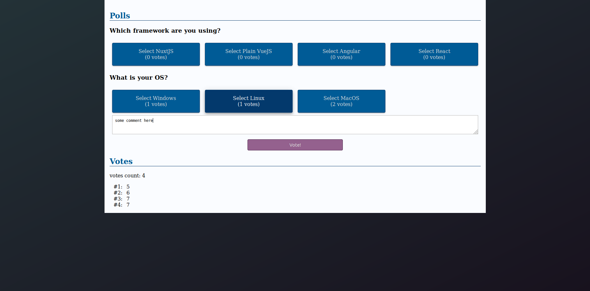

## Style

This part is not related to TypeScript but having a plain interface is somehow
hurtful. Let's dress our pages.

### SCSS

SCSS will help us to add some colours! Nuxt community makes our lives
easier with the [`style-resources-module`](https://github.com/nuxt-community/style-resources-module).

> Many thanks to [this article](https://hackernoon.com/how-i-use-scss-variables-mixins-functions-globally-in-nuxt-js-projects-while-compiling-css-utilit-58bb6ff30438)

```sh
yarn add --dev sass-loader node-sass @nuxtjs/style-resources
```

Following the `style-resources-module` documentation, let's update our _nuxt.config.ts_:

```ts
module.exports = {
  modules: ['@nuxtjs/style-resources'],

  styleResources: {
    // Don't forget to create both empty files
    //  if you use this
    scss: [
      // theme variables
      './assets/scss/_variables.scss',
      // mixins & abstract classes
      './assets/scss/_mixins.scss'
    ]
  }
};
```

SCSS can now be used in _.vue_ files:

```html
<style lang="scss"></style>
```

Additionally, thanks to `style-resources-module`, all variables in _./assets/scss/\_variables.scss_
and mixins from _./assets/scss/\_mixins.scss_ are available in _.vue_ files.

### Styling

Nothing very exciting over here, just regular (S)CSS. As for the theme colors, I was never
inspired when it comes to colors. Feel free to pick up you own colors.

```scss
// assets/scss/_variables.scss

$colorBgStart: #233237;
$colorBgEnd: #18121e;
$colorPrimary: #005b96;
$colorPrimaryDark: #03396c;
$colorSecondary: #94618e;
$colorSecondaryDark: #49274a;
```

I just added some media queries, for responsiveness, and some material
design inspired box shadows as mixins:

```scss
@mixin lt-sm {
  @media screen and (max-width: 575px) {
    @content;
  }
}
@mixin gt-sm {
  @media screen and (min-width: 576px) {
    @content;
  }
}

/* https://medium.com/@ladyleet/adding-box-shadow-z-depth-to-angular-material-2-components-6bd0de303dcb */
%transition-box-shadown {
  transition: box-shadow 0.2;
}
%z-depth-1 {
  @extend %transition-box-shadown;
  box-shadow: 0 2px 2px 0 rgba(0, 0, 0, 0.14), 0 1px 5px 0 rgba(0, 0, 0, 0.12),
    0 3px 1px -2px rgba(0, 0, 0, 0.2);
}

%z-depth-2 {
  @extend %transition-box-shadown;
  box-shadow: 0 4px 5px 0 rgba(0, 0, 0, 0.14), 0 1px 10px 0 rgba(0, 0, 0, 0.12),
    0 2px 4px -1px rgba(0, 0, 0, 0.3);
}

%z-depth-3 {
  @extend %transition-box-shadown;
  box-shadow: 0 6px 10px 0 rgba(0, 0, 0, 0.14), 0 1px 18px 0 rgba(0, 0, 0, 0.12),
    0 3px 5px -1px rgba(0, 0, 0, 0.3);
}

%z-depth-4 {
  @extend %transition-box-shadown;
  box-shadow: 0 8px 10px 1px rgba(0, 0, 0, 0.14), 0 3px 14px 2px rgba(0, 0, 0, 0.12),
    0 5px 5px -3px rgba(0, 0, 0, 0.3);
}

%z-depth-5 {
  @extend %transition-box-shadown;
  box-shadow: 0 16px 24px 2px rgba(0, 0, 0, 0.14), 0 6px 30px 5px rgba(0, 0, 0, 0.12),
    0 8px 10px -5px rgba(0, 0, 0, 0.3);
}
```

Nuxt works with [layouts](https://nuxtjs.org/guide/views#layouts). For the moment,
let's only use the default layout, namely: _layouts/default.vue_:

```vue
<template>
  <div>
    <main>
      <nuxt />
    </main>
  </div>
</template>

<style lang="scss">
body {
  margin: 0;
  padding: 0;
  background-image: linear-gradient(
    to bottom right,
    $colorBgStart,
    $colorBgEnd
  );
  min-height: 100vh;
}

main {
  width: 100%;
  max-width: 1200px;
  margin: 0 auto;
  background: #fafcff;
  padding: 1rem;
  box-sizing: border-box;
}
</style>
```

Thanks to our previous SCSS configuration, `$colorBgStart` and `$colorBgEnd` here
resolve to appropriate values.

> Don't forget `lang="scss"`!

Similarly, let's have our `h2` colored. Our _components/polls/PollList.vue_
can be updated as follows:

```vue
<template>
  <div>
    <div>
      <h2>Polls</h2>
      <poll-detail
        v-for="poll in polls"
        :key="'poll-' + poll.id"
        :poll="poll"
      />
    </div>

    <div>
      <h2>Votes</h2>
      <p>votes count: {{ votes.length }}</p>
      <div v-for="vote in votes" :key="'vote-' + vote.id" class="poll__vote">
        <span>#{{ vote.id }}:</span>
        <span>{{ vote.choiceId }}</span>
        <span v-if="vote.comment !== undefined && vote.comment.length > 0"
          >({{ vote.comment }})</span
        >
      </div>
    </div>
  </div>
</template>

<script lang="ts">
// unchanged
</script>

<style lang="scss" scoped>
h2 {
  color: $colorPrimary;
  border-bottom: 1px solid $colorPrimaryDark;
}

.poll__vote {
  span:first-child {
    display: inline-block;
    width: 40px;
    text-align: right;
    margin-right: 8px;
  }
}
</style>
```

> I used `scoped` because I want to apply this style only in this components.
> [Vue _Scoped CSS_ documentation](https://vue-loader.vuejs.org/guide/scoped-css.html)
> can be refered for more information.

I have modified the vote section in the template.

Let's keep going and update our _components/polls/PollDetail.vue_. The style is
not relevant to this tutorial so the code below is only an example. Interesting
SCSS points may be:

- [SCSS mixins](https://sass-lang.com/guide)
- [SCSS inheriance](https://sass-lang.com/guide)

```vue
<template>
  <div>
    <h3>{{ poll.topic }}</h3>

    <div class="poll__choice--list">
      <div
        class="poll__choice--container"
        v-for="choice in poll.choices"
        :key="choice.id"
        @click="selectChoice(choice)"
      >
        <div class="poll__choice--box" :class="selectedChoiceClass(choice)">
          <span>Select {{ choice.text }}</span>
          <span>({{ choice.count }} votes)</span>
        </div>
      </div>
    </div>

    <div v-if="selectedChoiceId > 0" class="poll__vote">
      <textarea
        v-model="comment"
        placeholder="Enter an optional comment here"
      ></textarea>
      <button @click="voteChoice()">Vote!</button>
    </div>
  </div>
</template>

<script lang="ts">
// unchanged
</script>

<style lang="scss">
.poll__choice--list {
  display: flex;
  flex-flow: row wrap;
}

.poll__choice--container {
  width: 100%;
  padding: 0.5rem;
  box-sizing: border-box;
  @include gt-sm {
    width: 25%;
  }
}

.poll__choice--box {
  @extend %z-depth-1;
  background-color: $colorPrimary;
  color: #ddd;
  padding: 1rem;
  border: 1px solid $colorPrimaryDark;
  border-radius: 4px;
  transition: background-color 0.2s, color 0.2s;

  span {
    display: block;
    text-align: center;
  }
  &:hover {
    cursor: pointer;
    @extend %z-depth-2;
  }

  &.selected {
    @extend %z-depth-3;
    background-color: $colorPrimaryDark;
    color: #fff;
  }
}

.poll__vote {
  textarea {
    width: calc(100% - 1rem);
    margin: 0px 0.5rem;
    padding: 0.5rem;
    box-sizing: border-box;
    resize: vertical;
  }
  button {
    display: block;
    margin: 1rem auto;
    width: 50%;
    max-width: 300px;
    padding: 8px 0px;
    background-color: $colorSecondary;
    color: #ddd;
    border: 1px solid $colorSecondaryDark;
    border-radius: 4px;
    transition: background-color 0.2s, color 0.2s;

    &:hover {
      cursor: pointer;
      background-color: $colorSecondaryDark;
      color: #fff;
    }
  }
}
</style>
```

> I am using a [_BEM-like_](http://getbem.com/introduction/) naming convention
> for my CSS classes. Feel free to use your own convention.

With all the examples above, my poll page looks like this:



After voting, my vote appears:


### Filters

While being a Vue.js feature, I add filters here because it is somehow
related to appearances.

Votes list displays the ID of voted choice but it would be better to have
the choice name. This is where a [Filter](https://vuejs.org/v2/guide/filters.html)
could help us.

The idea would be, in _components/polls/PollList.vue_:

- create a computed property `choices` to have a flat list of choices
- loop through `choices` and return `choice.text`

Filters do not have their own decorator (see [Github issue](https://github.com/kaorun343/vue-property-decorator/issues/98#issuecomment-390161771))
and must be defined in `@Component({})`. Computed properties, via
`this.choices` are not available in `@Component({})`. The workaround
is then to pass `this.choices` as an argument of the filter:

```ts
@Component({
  // unchanged
  filters: {
    choiceName: (value: number, choices: Choice[]): string => {
      const choice = choices.find(choice => choice.id === value);
      return choice !== undefined ? choice.text : 'Error no choice found';
    }
  }
})
export default class PollList extends Vue {
  // unchaged

  // Computed properties are defined as getters
  public get choices(): Choice[] {
    return this.polls
      .map(poll => poll.choices)
      .reduce((p1, p2) => p1.concat(p2), []);
  }
}
```

We can now use the `choiceName` filter with the choices list provided by
the `choices()` computed properties:

```html
<span>{{ vote.choiceId | choiceName(choices) }}</span>
```

Now, votes display choice name:


