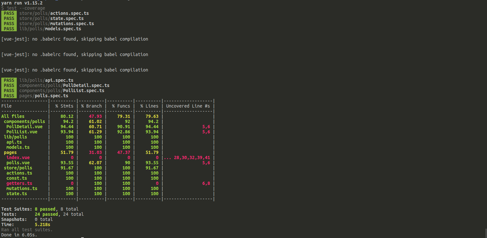
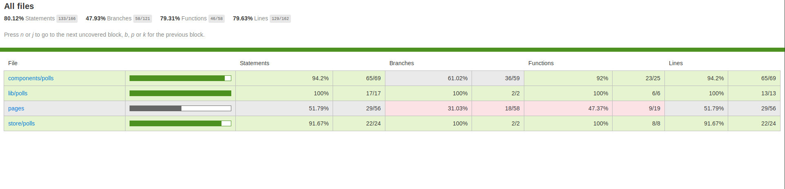

## Testing

> I consider unit testing as part of the code itself. Following Angular
> folder structure, I like having my `.spec.ts` along with the tested
> files. May you prefer to have a `tests/` folder at the root folder
> or a `__tests__/` at each folder level, feel free to adapt this tutorial
> to your taste.
>
> As for the mocks, I follow Jest convention by having a `__mocks__/` folder
> at each folder level

### Adding and configuring Jest

Following dependencies will be used:

- [Jest](https://jestjs.io/)

  Our test runner. As we are using TypeScript, [`@types/jest`](https://www.npmjs.com/package/@types/jest)
  is also added

- [vue-jest](https://github.com/vuejs/vue-jest)

  Jest transformer for our vue components

- [vue-test-utils](https://vue-test-utils.vuejs.org/)

  Vue official unit testing library. Equivalent of Enzyme for React

- [ts-jest](https://github.com/kulshekhar/ts-jest)

  TypeScript preprocessor for Jest

- [babel-core](https://github.com/babel/babel-bridge)

  Required for `vue-jest` ([StackOverflow link](https://stackoverflow.com/a/54689793/4906586))

```sh
yarn add --dev jest @types/jest vue-jest @vue/test-utils ts-jest babel-core@^7.0.0-bridge.0
```

Add Jest types in _tsconfig.json_:

```json
{
  "compilerOptions": {
    "types": ["@types/node", "@nuxt/vue-app", "@types/jest"]
  }
}
```

Add a `test` script in _package.json_:

```json
{
  "scripts": {
    "dev": "nuxt-ts",
    "build": "nuxt-ts build",
    "start": "nuxt-ts start",
    "generate": "nuxt-ts generate",
    "test": "jest"
  }
}
```

Add a Jest configuration file, _jest.config.js_:

```js
module.exports = {
  moduleNameMapper: {
    '^@/(.*)$': '<rootDir>/$1',
    // this line is optional and the tilde shortcut
    // will not be used in this tutorial
    '^~/(.*)$': '<rootDir>/$1'
  },
  transform: {
    '^.+\\.ts?$': 'ts-jest',
    '.*\\.(vue)$': 'vue-jest'
  },
  moduleFileExtensions: ['ts', 'js', 'vue', 'json'],

  collectCoverageFrom: [
    'components/**/*.vue',
    'layouts/**/*.vue',
    'pages/**/*.vue',
    'lib/**/*.ts',
    'plugins/**/*.ts',
    'store/**/*.ts'
  ]
};
```

For more detail: [Jest configuration documentation](https://jestjs.io/docs/en/configuration)

> [`collectCoverageFrom`](https://jestjs.io/docs/en/cli#collectcoveragefrom-glob): we will
> be using Jest coverage (which uses Istanbul behind the hoods). We are listing all folders
> than have to be scanned for coverage so that files which do not have a corresponding
> `.spec.ts` file are flagged as _non tested_ instead of being skipped.

Finally, add a _ts-shim.d.ts_ at root level:

```ts
declare module '*.vue' {
  import Vue from 'vue';
  export default Vue;
}
```

If this shim were missing, running tests against Vue components will trigger an
error: `error TS2307: Cannot find module '{path to component}'.`. Kudos to
[Beetaa](https://github.com/beetaa/) for
[the solution](https://github.com/vuejs/vue/issues/5298#issuecomment-453343514)

> Note: _lib/polls/_ testing is pure TypeScript testing and will be skipped in
> in this tutorial. For the sake of completion, feel free to check:
>
> - [_/lib/polls/api.spec.ts_](https://github.com/Al-un/nuxt-ts/blob/master/lib/polls/api.spec.ts)
> - [_/lib/polls/models.spec.ts_](https://github.com/Al-un/nuxt-ts/blob/master/lib/polls/models.spec.ts)

You are now ready to run tests with

```
yarn test
```

May you are interested into test coverage, please run

```
yarn test --coverage
```

and then check _coverage/lcov-report/index.html_.

### Vuex testing

As vuex files are plain TypeScript files, it is easier to start there. Let's
create the following files:

- _/store/polls/state.spec.ts_
- _/store/polls/mutations.spec.ts_
- _/store/polls/actions.spec.ts_

Getter is empty so there is nothing to test.

I mocked a state in [_store/polls/\_\_mocks\_\_/state.mock.ts_](https://github.com/Al-un/nuxt-ts/blob/master/store/polls/__mocks__/state.mock.ts).

State and mutations testing are pure TypeScript testing and
present not much of interest. I then just add the link to the
test files:

- [_/store/polls/state.spec.ts_](https://github.com/Al-un/nuxt-ts/blob/master/store/polls/state.spec.ts)
- [_/store/polls/mutations.spec.ts_](https://github.com/Al-un/nuxt-ts/blob/master/store/polls/mutations.spec.ts)

Actions testing involve API calls. Right, we are not really calling
any back-end but let's imagine we were. Testing should avoid any
network call. To fix this, Jest has the [manual mock](https://jestjs.io/docs/en/manual-mocks.html)
feature.

Following Jest convention, my API mock is located at
[_lib/polls/\_\_mocks\_\_/api.ts_](https://github.com/Al-un/nuxt-ts/blob/master/lib/polls/__mocks__/api.ts):

```ts
import { Poll, Vote } from '../models';

export const DUMMY_POLLS: Poll[] = [
  // ...
];

export const DUMMY_VOTES: Vote[] = [
  // ...
];

export const loadPolls = jest.fn().mockImplementation(
  (): Promise<Poll[]> => {
    return new Promise<Poll[]>(resolve => resolve(DUMMY_POLLS));
  }
);
```

Two points have to be noticed:

- The `loadPolls` function is exactly identical to the real one
- `loadPolls` definition is not a function but a `jest.fn()` mock

With such mock, we just have to call

```ts
// Beware of the star import !!
import * as api from '@/lib/polls/api';

jest.mock('@/lib/polls/api.ts');
```

at the top of our action testing file. There is no much to add besides
the mock point so here is the link of the testing file:

- [_/store/polls/actions.spec.ts_](https://github.com/Al-un/nuxt-ts/blob/master/store/polls/actions.spec.ts)

At this stage, API is only returning dummy values and votes are not
processed by any back-end (e.g. vote ID has to be generated by a
back-end). API structure will evolve, when Axios will enter the scene,
and tests will have to be updated accordingly

### Components testing

As Vue components testing relies on Vue Test Utils, please refer
to the [Vue Test Utils documentation](https://vue-test-utils.vuejs.org/)
if necessary

`PollDetail` and `PollList` are tested by:

- [_/components/polls/PollDetail.spec.ts_](https://github.com/Al-un/nuxt-ts/blob/master/components/polls/PollDetail.spec.ts)
- [_/components/polls/PollList.spec.ts_](https://github.com/Al-un/nuxt-ts/blob/master/components/polls/PollList.spec.ts)

As Nuxt pages are Vue components, polls page is tested by:

- [_/pages/polls.spec.ts_](https://github.com/Al-un/nuxt-ts/blob/master/pages/polls.spec.ts)

#### Shallow mounting

When [shallow mounting](https://vue-test-utils.vuejs.org/guides/#common-tips)
components, props and methods can be mocked:

```ts
const options = {};
const wrapper: Wrapper<PollList> = shallowMount(PollList, options);
```

Interesting options are:

- `propsData` to mock props (from _PollList.spec.ts_):

  ```ts
  import { DUMMY_POLLS, DUMMY_VOTES } from '@/lib/polls/__mocks__/api';

  const poll: Poll = DUMMY_POLLS[0];
  const wrapper: Wrapper<PollList> = shallowMount(PollList, {
    propsData: { polls: DUMMY_POLLS, votes: DUMMY_VOTES }
  });
  ```

- `methods` to override component methods definition. This could help for
  mocking or simply using another implementation (from _PollDetail.spec.ts_):

  ```ts
  import { DUMMY_POLLS } from '@/lib/polls/__mocks__/api';

  const poll: Poll = DUMMY_POLLS[0];
  const mockedVote: jest.Mock = jest.fn();

  const wrapper: Wrapper<PollDetail> = shallowMount(PollDetail, {
    propsData: { poll },
    methods: { vote: mockedVote }
  });
  ```

Please check [Vue Test Utils mounting options](https://vue-test-utils.vuejs.org/api/options.html)
for more details

#### Mocking Vuex store

Because _Polls_ page uses mapped state, Vuex Store has to be mocked as well.
Vue Test Utils has some [documentation dedicated to testing
Vuex in components](https://vue-test-utils.vuejs.org/guides/#testing-vuex-in-components)

```ts
import { shallowMount, Wrapper, createLocalVue } from '@vue/test-utils';
import Vuex, { Store } from 'vuex';

import Polls from './polls.vue';
import { RootState } from '@/store/types';
import { mock1 } from '@/store/polls/__mocks__/state.mock';

// Vue config
const localVue = createLocalVue();
localVue.use(Vuex);

// Vuex config
let store: Store<RootState>;

// Component config
let wrapper: Wrapper<Polls>;
const loadPolls: jest.Mock = jest.fn();

store = new Vuex.Store({
  modules: {
    polls: {
      namespaced: true,
      actions: { load: loadPolls },
      state: mock1()
    }
  }
});

const wrapper: Wrapper<Polls> = shallowMount(Polls, { localVue, store });
```

> Don't forget to have `namespaced: true`. All store within _store/{some folder}_
> are namespaced by default in Nuxt

Only the required action and state are mocked. There is no need to mock
mutations and other actions as they are not used by _Polls_ page.

### Coverage

To generate coverage report, run

```sh
yarn test --coverage
```

and you will have a nice output:



Open _coverage/lcov-report/index.html_ to have a detail HTML report:


